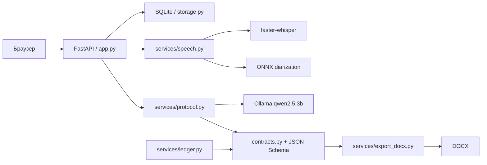
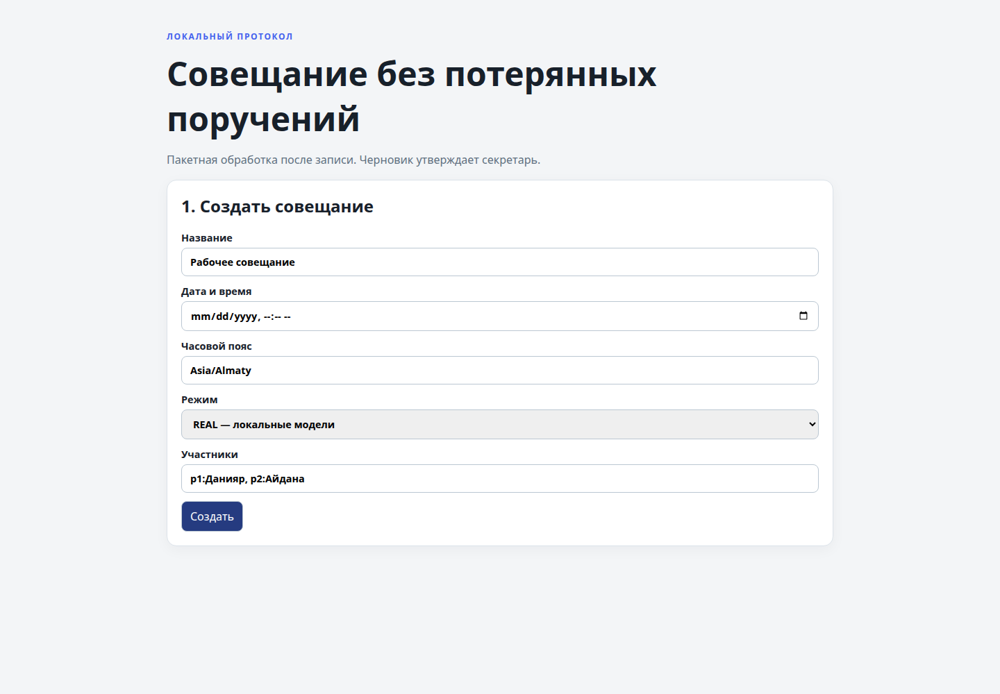
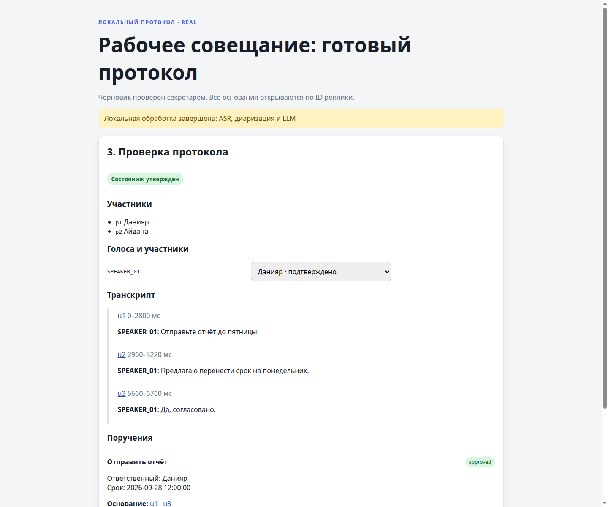

# Совещание без потерянных поручений

Локальный прототип секретаря совещаний: запись проходит через распознавание
речи и диаризацию, затем из транскрипта формируется проверяемый протокол с
поручениями, сроками и ссылками на реплики. Секретарь подтверждает соответствие
голоса участнику, исправляет черновик и только после этого утверждает и
экспортирует DOCX.

Проект рассчитан на команды, которым нужен воспроизводимый протокол без
отправки аудио и текста во внешнее облако. Приложение работает на одном
локальном компьютере и обрабатывает одно совещание за раз.

## Что реализовано

- локальный веб-интерфейс на русском языке;
- два явно различающихся режима: `REAL` (локальные модели) и `FIXTURE`
  (детерминированный синтетический пример);
- загрузка аудио/видео и фоновая обработка с отображением статуса job;
- транскрибирование через локальный `faster-whisper` без перевода исходной
  речи;
- диаризация через открытый ONNX-экспорт сегментации, после которой секретарь
  вручную подтверждает `speaker_id → participant_id`;
- извлечение саммари, поручений, сроков, вопросов по отсутствующим реквизитам и
  предупреждений через локальную модель Ollama;
- evidence: каждая реплика, поручение и изменение связаны с существующими
  временными интервалами транскрипта;
- ручное исправление поручений с аудитом и типизированный ledger для событий
  `create/propose/accept/reject/cancel` с воспроизведением по времени;
- просмотр событий выбранного интервала («что обсуждали»);
- явное утверждение протокола человеком и экспорт черновика или утверждённой
  версии в DOCX;
- JSON Schema протокола версии 1.0 и семантическая проверка ссылок, участников,
  дат и интервалов.

## Как работает решение

1. Секретарь создаёт встречу, указывает дату, часовой пояс и участников.
2. Выбирается `REAL` или `FIXTURE`, затем загружается локальная запись.
3. В `REAL` локальные Whisper и ONNX-диаризатор создают реплики с временными
   метками и слотами говорящих. В `FIXTURE` берётся только заранее сохранённый
   пример; он помечается в интерфейсе как синтетический.
4. Секретарь сопоставляет слоты говорящих с участниками и подтверждает карту.
   Это ручное подтверждение, а не биометрическая идентификация.
5. Локальная Ollama-модель извлекает черновик протокола. Сроки считаются от
   даты совещания в его часовом поясе; неизвестные исполнитель и срок остаются
   `null`.
6. Секретарь проверяет evidence, редактирует поля при необходимости,
   утверждает протокол и скачивает DOCX с соответствующей маркировкой.

## Технологии и модели

| Слой | Реализация |
|---|---|
| Язык и запуск | Python 3.12, FastAPI, Uvicorn |
| Хранилище | SQLite (`storage.py`) |
| Интерфейс | HTML, CSS и vanilla JavaScript в `static/` |
| Распознавание | `faster-whisper` / CTranslate2, локальная модель `Systran/faster-whisper-small` |
| Диаризация | ONNX Runtime, `soundfile`, `scipy`; локальный открытый экспорт `FredrikKarlssonSpeech/pyannote-speaker-diarization-onnx` |
| Извлечение протокола | Ollama на loopback (`127.0.0.1:11434`), модель `qwen2.5:3b` |
| Контракты и экспорт | `jsonschema`, `python-docx`, `contract.schema.json`, `ledger.schema.json` |
| Проверки | стандартный `unittest`, скрипты `preflight.py`, `model_manifest.py`, `cli.py` |

В рабочем режиме приложение не обращается к внешнему API. Hugging Face нужен
только для предварительного скачивания весов в локальные каталоги; Ollama также
запускается локально. Модели, записи и секреты не входят в Git.

## Архитектура



Основные точки HTTP-контракта: `POST /api/meetings`, `POST
/api/meetings/{id}/audio`, `GET /api/jobs/{id}`, `GET
/api/meetings/{id}/protocol`, `PUT /api/meetings/{id}/speaker-map`, `POST
/api/meetings/{id}/extract`, `PATCH /api/meetings/{id}/tasks/{task_id}`, `POST
/api/meetings/{id}/approve`, `GET /api/meetings/{id}/export.docx` и `POST
/api/meetings/{id}/catch-up`. Полный список и форматы находятся в [API.md](API.md).

## Интерфейс

Главный экран объединяет создание встречи, загрузку записи, транскрипт,
подтверждение говорящих, поручения, вопросы секретарю и экспорт.



Заполненный экран показывает транскрипт с временными метками, speaker map,
evidence и действие скачивания DOCX.



## Установка и запуск

### 1. Python-окружение

```bash
python3 -m venv .venv
.venv/bin/pip install -r requirements.txt
.venv/bin/python scripts/cli.py test
```

`requirements.txt` устанавливает только Python-зависимости. Веса моделей не
скачиваются автоматически.

### 2. Подготовка локальных моделей (один раз при доступной сети)

ASR-модель должна находиться в `models/faster-whisper-small`:

```bash
.venv/bin/pip install huggingface_hub
.venv/bin/python - <<'PY'
from huggingface_hub import snapshot_download
snapshot_download("Systran/faster-whisper-small", local_dir="models/faster-whisper-small")
snapshot_download(
    "FredrikKarlssonSpeech/pyannote-speaker-diarization-onnx",
    local_dir="models/pyannote-onnx",
)
PY
```

Локальный runtime Ollama должен содержать `qwen2.5:3b`. В текущем окружении
используется бинарник `.local/bin/ollama` и каталог `models/ollama` (оба
игнорируются Git):

```bash
mkdir -p models/ollama
OLLAMA_HOST=127.0.0.1:11434 \
OLLAMA_MODELS="$PWD/models/ollama" \
OLLAMA_NO_CLOUD=1 \
.local/bin/ollama serve
```

В другом терминале при необходимости выполните `.local/bin/ollama pull
qwen2.5:3b`. Если бинарник Ollama ещё не подготовлен в окружении, его нужно
установить отдельно до запуска этого шага.

### 3. Переменные окружения

Для CPU достаточно значений по умолчанию. Для проверенного GPU-профиля RTX
3070 использовались:

```bash
export WHISPER_MODEL_PATH="$PWD/models/faster-whisper-small"
export PYANNOTE_MODEL_PATH="$PWD/models/pyannote-onnx"
export WHISPER_DEVICE=cuda
export WHISPER_COMPUTE_TYPE=float16
export OLLAMA_HOST=http://127.0.0.1:11434
export OLLAMA_MODEL=qwen2.5:3b
export OLLAMA_NO_CLOUD=1
export OLLAMA_BIN="$PWD/.local/bin/ollama"
export LD_LIBRARY_PATH="$PWD/.venv/lib/python3.12/site-packages/nvidia/cublas/lib:$PWD/.venv/lib/python3.12/site-packages/nvidia/cuda_nvrtc/lib:$LD_LIBRARY_PATH"
```

На CPU задайте `WHISPER_DEVICE=cpu` и `WHISPER_COMPUTE_TYPE=int8`.

### 4. Запуск приложения

```bash
.venv/bin/python scripts/preflight.py --json --strict
.venv/bin/python scripts/cli.py run --host 127.0.0.1 --port 8000
```

Откройте <http://127.0.0.1:8000>. Остановить сервер можно командой:

```bash
.venv/bin/python scripts/cli.py stop
```

## Как проверить решение

Быстрый сценарий для жюри не требует моделей и показывает весь интерфейс:

```bash
.venv/bin/python scripts/cli.py test
.venv/bin/python check_examples.py
.venv/bin/python scripts/cli.py run --host 127.0.0.1 --port 8000
```

В браузере:

1. выберите `FIXTURE — синтетический пример`;
2. создайте встречу с участниками `p1:Данияр, p2:Айдана`;
3. выберите небольшой локальный аудиофайл и нажмите «Загрузить и обработать»;
4. подтвердите speaker map, нажмите «Извлечь поручения»;
5. проверьте evidence и статус черновика, затем утвердите и скачайте DOCX.

Для проверки окружения с локальными моделями:

```bash
DIARIZATION_MODEL_PATH="$PWD/models/pyannote-onnx" \
OLLAMA_BIN="$PWD/.local/bin/ollama" \
.venv/bin/python scripts/preflight.py --json --strict
.venv/bin/python -m unittest discover -s tests -v
```

Фактические артефакты текущей проверки:

| Проверка | Результат | Артефакт |
|---|---|---|
| Unit, контрактные, protocol, ledger и DOCX-тесты | 18 тестов, `PASS` | `reports/test-results.json` |
| ASR на трёх WAV, сгенерированных `espeak` | `PASS`, GPU-профиль | [`reports/real-asr/gpu-results.json`](reports/real-asr/gpu-results.json) |
| ASR + ONNX-диаризация на RU/KK/MIX файлах | технический путь `PASS` | [`reports/real-pipeline/speech-diarization.json`](reports/real-pipeline/speech-diarization.json) |
| Полный локальный HTTP-путь для RU | job `done`, extraction HTTP 200, DOCX создан | [`reports/real-pipeline/http-real-ru.json`](reports/real-pipeline/http-real-ru.json) |
| Полный прямой путь KK и MIX | контрактный результат `PASS` | [`full-kk_case.json`](reports/real-pipeline/full-kk_case.json), [`full-mix_case.json`](reports/real-pipeline/full-mix_case.json) |

## Данные и интеграции

- `examples/` содержит три вымышленных JSON-эталона для `FIXTURE`; это не
  результаты распознавания.
- Загруженные записи и SQLite-файл хранятся локально в `data/` и не отслеживаются
  Git.
- Контракт протокола описан в [`contract.schema.json`](contract.schema.json),
  история изменений — в [`ledger.schema.json`](ledger.schema.json).
- Входной текст транскрипта передаётся модели как данные в разделённом блоке;
  он не является инструкцией и не получает права выполнять команды.
- Сетевые адреса моделей и Ollama ограничены локальными путями и loopback;
  произвольные URL для скачивания моделей запрещены.

## Ограничения текущей версии

- Реальные прогонки выполнены на синтетической речи, созданной `espeak`.
  Это подтверждает технический pipeline, но не качество распознавания живой
  записи: в KK/MIX отчётах текст и определённый язык могут быть ошибочными.
- ONNX-адаптер выдаёт слоты активности говорящих. Связь слота с человеком
  подтверждает секретарь; голосовая биометрическая идентификация не выполняется.
- Гейтированный оригинальный snapshot `pyannote/speaker-diarization-community-1`
  в текущем окружении недоступен, поэтому используется открытый ONNX-экспорт.
- `scripts/cli.py verify --profile full --offline` оставляет проверки новой
  естественной RU/KK/MIX записи и браузерного offline E2E как `NOT RUN` и
  возвращает код 2, пока эти проверки не выполнены отдельно.
- Поддерживается одно совещание за раз. Нет интеграций Teams/Zoom/Meet,
  удалённой очереди, промышленной аутентификации или распознавания лиц.
- Скорость и качество извлечения зависят от локального Ollama и выбранной
  модели; при отсутствии модели `REAL` завершается явной ошибкой и не заменяется
  fixture-путём.

## Deployed-версия

Публичной или удалённой deployed-версии нет. Запуск предусмотрен локально по
адресу <http://127.0.0.1:8000>.

## Структура репозитория

- [`app.py`](app.py), [`storage.py`](storage.py) — HTTP-приложение и SQLite;
- [`services/speech.py`](services/speech.py) — ASR и диаризация;
- [`services/protocol.py`](services/protocol.py) — извлечение протокола;
- [`services/ledger.py`](services/ledger.py) — история событий;
- [`services/export_docx.py`](services/export_docx.py) — экспорт;
- [`static/`](static/) — интерфейс;
- [`scripts/cli.py`](scripts/cli.py), [`scripts/preflight.py`](scripts/preflight.py)
  — запуск и проверки;
- [`AGENTS.md`](AGENTS.md), [`API.md`](API.md), [`DEMO.md`](DEMO.md) — правила,
  API и сценарий демонстрации.
